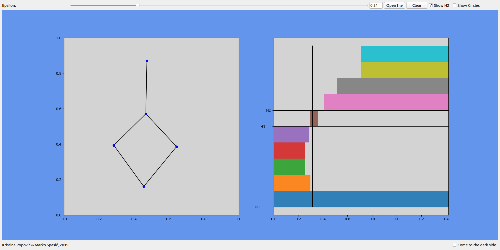
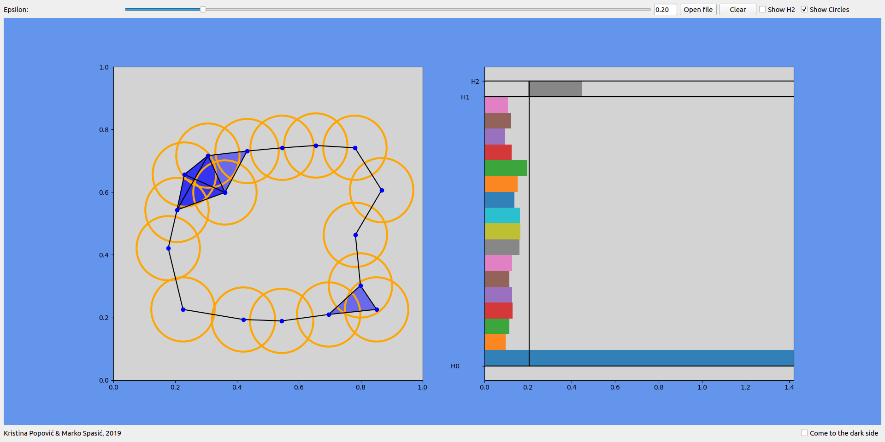

#  Persistent Homology visualizer

Persistentna homologija je algebarski metod za uočavanje topoloških osobina podataka. Neke od topoloških osobina koje se mogu prepoznati
korišćenjem persistentne homologije su: komponentne povezanosti, rupe, klasteri, struktura grafa, dok podaci mogu biti skup tačaka sa metrikom.

Na levom plotu korisnik klikom miša postavlja tačke. Program za postavljenje tačke izračunava perzistentnu homologiju. 
Prevlačenjem epsilon slajdera može se videti stanje Ripsovog Complexa (levo) za svako epsilon.

Sa desne strane prikazan je generisan Barcode koje predstavlja diagram perzistencije gde je za svako epislon prikazan trenutak 'rađanja' i 'umiranja' komponente.

### Plan projekta

Projekat je napravljen u programskom jeziku Python (3.6)
 
 Korišćene biblioteke:
* [dionysus2](https://mrzv.org/software/dionysus2/) - od [Dmitriy Morozov](https://www.mrzv.org/). Za konstruisanje Vietoris–Rips Complexe-a od datog skupa tačaka, računanje persistentne homologije i generisanje diagrama persistencije.
* [PyQt5](https://pypi.org/project/PyQt5/) - crtanje GUI-a
* [matplotlib](https://matplotlib.org/) - iscrtavanje Vietoris-Rips Complex i dijagrama persistencije
* [numpy](https://www.numpy.org/) - reprezentacija i generisanje tačaka
* [shapely](https://pypi.org/project/Shapely/) - popunjavanje i konstruisanje poligona za iscrtavanje

### Instalacija:

Program je kompatibilan za operativim sistemom Ubuntu bilo koje verzije
na kojoj mogu biti instalirane dole navedene biblioteke.
#### Ubuntu:
Instalirati python3:

`sudo apt-get install python3 python3-pip`

Biblioteka dionysus koristi C++ biblioteku boost i cmake build sistem. Instalirati boost i cmake pokretanjem:

`sudo apt-get install libboost-all-dev cmake`

Zatim instalirati potrebne python pakete pokretanjem:

`pip3 install shapely PyQt5 matplotlib dionysus qdarkstyle`

Skinuti projekat kao zip fajl dirketno sa https://github.com/spaske00/mk2019/archive/master.zip ili klonirati repozitorijum.

### Pokretanje:

#### Ubuntu:
Kao python script:

`cd project/folder`

`python3 PHV.py`

### Autori:
Kristina Popović (mi16058@alas.math.rs)

Marko Spasić (mi16165@alas.math.rs) 